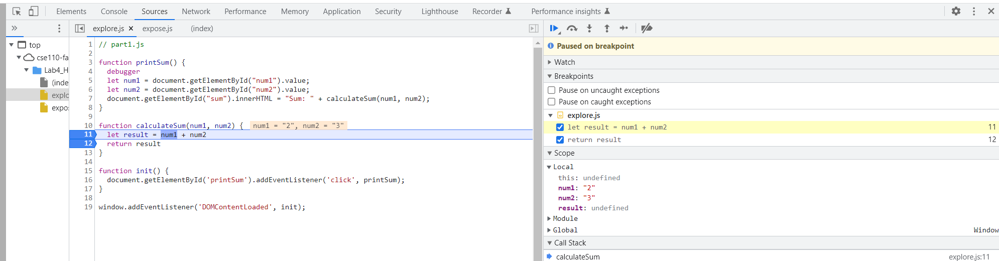
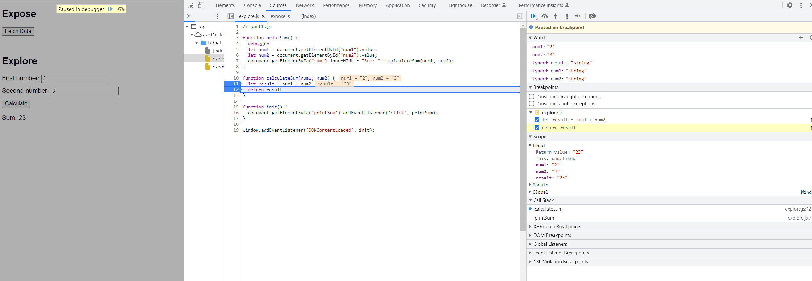
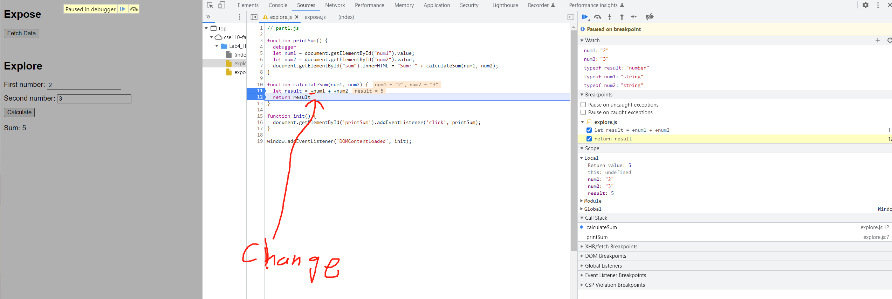

**result-calculateSum.png**  

**result-dataType.png**  

1. the bug is that `num1` and `num2` are assigned string value and that is why the result is concatenation

**2.**  
**fix.png**  
  

I fixed this by adding a `+` in ront of `num1` and `num2` in line 11 so when I assign `result` equal to the sum of `num1` and `num2`, they  
are added together as number so that  the `result` has typeof number
